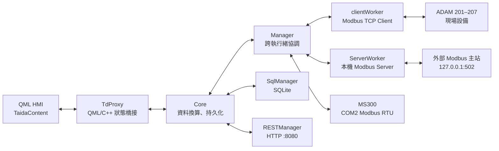

# Taida ADAM-6000 專案架構與流程說明

> 本文件依目前工作樹中的程式碼整理（2026-07-27）。它描述「實際已接線的行為」；標示為未接線或未完成者不應被當成已生效功能。

## 1. 專案定位

此專案是以 **Qt 6 / QML** 開發的 Windows 工業設備監控與控制程式。它同時扮演四種角色：

1. 操作員 HMI：顯示水路、風路、閥門、九台風扇與泵浦的即時值，並接受操作。
2. Modbus TCP Client：輪詢 ADAM-6000 模組與 ADAM-6022 PID 控制器，並將控制指令寫回。
3. Modbus TCP Server：在本機 `127.0.0.1:502` 提供暫存器映像給外部 Modbus 主站。
4. 資料服務：將感測／Holding Register 快照寫入 SQLite，並在 `0.0.0.0:8080` 提供 REST 查詢與設定 API。

## 2. 原始碼與建置結構

| 路徑 | 職責 |
| --- | --- |
| `App/main.cpp` | 程式入口、單一實例鎖、日誌、Windows minidump、初始化 Core、載入 QML。 |
| `Core/` | 所有領域邏輯、通訊、資料庫、HTTP 與狀態橋接。 |
| `TaidaContent/` | 實際 HMI 畫面與 QML 互動邏輯。 |
| `Taida/` | Qt Design Studio 常數與事件模擬器定義。 |
| `Dependencies/Components/` | Qt Design Studio 元件／相容層與工具模組；屬通用基礎設施，沒有此 app 的設備控制流程。 |
| `Generated/`、`cmake-build-*`、`out/` | 產生或建置輸出，不是手寫核心邏輯。 |

根目錄 `CMakeLists.txt` 要求 Qt 6.8，使用 Core、Quick、QML、SerialBus、Sql、Network、HttpServer 等模組。`qds.cmake` 將 HMI、Qt Design Studio 元件與 `App` 編入主執行檔 `TaidaApp`。

## 3. 啟動與結束流程

### 3.1 啟動

1. `main()` 開啟工作目錄下的 `app_log.txt`，註冊 Qt message handler；未處理的 Windows 例外會寫入 `crash.dmp`。
2. 以 `QLocalServer` 名稱 `TaidaApp_single_instance_lock` 檢查單一實例；已存在時直接結束。
3. 取得 `Core::instance()`，呼叫 `Core::init()`。
4. `Core::init()` 依序：
   - 取得 singleton `SqlManager`，建立 `RESTManager` 並監聽 HTTP `:8080`。
   - 建立 `TdProxy` 與 `Manager`。
   - 初始化 SQLite 資料目錄／設定資料庫。
   - 建立 QML 可存取的單例 `Core 1.0/Td`。
5. 載入 `TaidaContent/App.qml`；它建立 `Window` 與 `MainScreen`。
6. `Manager` 建構時建立並啟動三條執行緒：Modbus client、Modbus server、MS300 serial RTU。
7. ADAM-6250（201）連線成功後，`clientWorker` 發出 `connected`；Core 載入 `production.ini` 的既有操作設定，設定變更再由輪詢流程送往設備。

### 3.2 結束

`Core` 解構時先寫入 `production.ini`，再釋放 `Manager` 與 `TdProxy`。`Manager` 依序停止 MS300、Modbus client、Modbus server 執行緒；`SqlManager` 自行停止其 SQLite worker thread。

## 4. 執行緒與元件責任

| 執行位置 | 物件 | 責任 |
| --- | --- | --- |
| 主／QML thread | `Core`、`TdProxy`、`RESTManager` | QML 狀態、數值換算、設定保存、HTTP。 |
| `clientWorker` thread | `clientWorker` | 每輪讀取現場 ADAM、依旗標／佇列執行寫入、讀寫 ADAM-6022 PID。 |
| `serverWorker` thread | `ServerWorker` | 維護 Modbus Server 暫存器映像，將外部寫入回報給 `Manager`。 |
| `MS300` thread | `MS300` | 經 `COM2` 輪詢變頻器 fault code。 |
| `SqlManagerThread` | `SqlManager` | 所有 SQLite 操作均透過 blocking queued invocation 在此 thread 執行。 |

`Manager` 是唯一的設備協調層：它將 QML 設定、外部 Modbus 寫入與設備回授統一到 `clientWorker` 的 queue／旗標，並把結果同步到 QML 與本機 Modbus Server。

## 5. 現場通訊與輪詢流程

### 5.1 固定設備拓撲

所有 TCP 設備皆使用 port `502`、unit/slave ID `1`；IP 目前硬編碼於 `clientWorker::init()`。

| 裝置 | IP／介面 | 讀取用途 | 寫入用途 |
| --- | --- | --- | --- |
| ADAM-6250 | `192.168.1.201` | coils `0..7` DI、`16..22` DO | coil 16 風扇電源、17 馬達、19 馬達 STO。 |
| ADAM-6217 #1 | `192.168.1.202` | holding `0..7` 類比輸入（水路／左側盤管）。 | 無。 |
| ADAM-6217 #2 | `192.168.1.203` | holding `0..7` 類比輸入（右側盤管、風路、流量、閥回授）。 | 無。 |
| ADAM-6224 #1 | `192.168.1.204` | holding `0..3` AO、coils `0..3` DI。 | holding `0..3`：泵浦與風扇 1–3。 |
| ADAM-6224 #2 | `192.168.1.205` | holding `0..3` AO。 | holding `0..3`：風扇 4–7。 |
| ADAM-6224 #3 | `192.168.1.206` | holding `0..3` AO。 | holding `0..2`：風扇 8–9 與一個保留通道。 |
| ADAM-6022 | `192.168.1.207` | PID PV/MV/PID 參數與一般 PV。 | PID mode、SV、PID 參數、AO1。 |
| MS300 | `COM2`，9600 8N1 | holding `0x2100`：fault code。 | 本檔未實作實際頻率／控制寫入。 |

### 5.2 一次輪詢週期

`clientWorker::poll()` 初始每 1000 ms 執行；每次執行先停止 timer，全部同步 Modbus 操作完成後才重啟，避免重入。

1. 檢查 201、202、203、204、205、206、6022 是否都已連線。
2. 任一斷線：呼叫 `reconnectDevices()`，500 ms 後重試，不讀寫資料。
3. 全部連線：依序讀 DI/DO、兩組 AI、三組 AO、6224 DI，組成 `readInput_Data`。
4. AI/AO 均非空時發出 `input_DATA`；Manager 更新本機 Modbus 映像，Core 更新 HMI、計算熱交換並依資料擷取頻率保存資料。
5. 讀 ADAM-6022 一般 PV（壓差／出風溫），處理等待執行的安全、風扇、PID、SV、AO 與 queue 寫入。
6. 再讀 ADAM-6022 的兩組 PV、兩個 MV、兩組 PID 參數，更新 HMI 與本機 Modbus 映像。

`WatchdogHeartbeatClient` 會在 client 建構時連往 `127.0.0.1:45454`，並在連線／每輪輪詢 `pulse()`；自動 heartbeat 已關閉。此 repository 只有 heartbeat client／協定，沒有 watchdog server。

## 6. 即時資料顯示與換算流程

### 6.1 感測資料

`Core::onSenserData()` 會先把各 ADAM 模組資料映射到 `TdProxy` 供 QML 綁定，再在達到 `read_frequency` 時建立 40 槽資料列。

| 來源 | 映射至 HMI | 主要換算 |
| --- | --- | --- |
| 202 AI 0–7 | 入水溫壓、出水溫壓、回水溫壓、左側盤管 1/2 | 溫度／部分類比：raw ÷ 655.35；壓力：raw ÷ 65.535。 |
| 203 AI 0–3 | 右側盤管 1/2、入風溫、入風濕 | raw ÷ 655.35。 |
| 203 AI 4 | 流量 | 低於閾值歸零，否則依 raw 換算到 0–800。 |
| 203 AI 5–6 | 出水閥、混水閥位置回授 | 20% 至 95% raw 範圍線性映射為 0–100%。 |
| 204–206 AO | 泵浦與九台風扇回授 | 風扇百分比為 raw ÷ 40.95；顯示 RPM 再乘 37.5。 |
| 6022 一般 PV | 壓差、出風溫 | 壓差依設定使用 0–1000 或 -1250–1250 換算；出風溫 raw ÷ 655.35。 |

熱交換值由 `(左側兩點與右側兩點的溫差平均) × 流量 × 4186 / 60000 × 998.5 / 1000` 計算，四捨五入至小數點後兩位，寫入 `Td.heatExchange`。

### 6.2 資料庫資料列

寫入的 `sensor_data.s1..s27`（其餘 s28..s40 留空）依序為：設備入水溫壓、設備出水溫壓、泵浦入水溫壓、左右盤管入出溫、入風溫濕、流量、出水閥 SV/PV、混水閥 SV/PV、風扇 1 SV/PV、出風溫、壓差 SV/PV、熱交換、風扇 PID mode、出水閥 PID mode、泵浦 SV/PV。

同一時間點也將 Server 的 `SaveData` 寫入 `holding_register.h1..h100`。

## 7. HMI 操作流程

QML 的實際互動事件位於 `TaidaContent/MainScreen.qml`，畫面配置與資料綁定位於 `TaidaContent/MainScreenUI.ui.qml`。所有操作先設定 `Td` 屬性，再由 `Core` 的 signal/slot 路徑送至 `Manager`。

### 7.1 泵浦、閥門與 PID

| 使用者操作 | Td 屬性 | 後端動作 |
| --- | --- | --- |
| 設定泵浦頻率 | `motorFrequency` | 轉成 `value = percent × 40.95 / 0.6`，更新 Server holding 31；若泵浦 STO 或兩閥皆低於 20%，強制為 0。 |
| 開關泵浦 STO | `motorFrequencySwitchOn` | `Manager::set_motor()` 更新 holding 72；client 下個週期寫 ADAM-6250 coil 19 與 coil 17。 |
| 設定出水閥開度 | `outValveOpening` | 以 20%–95% 的 ADAM-6022 AO 範圍換算，寫 PID 控制器 AO1（holding 11）。 |
| 開關出水閥 PID | `outValvePidOn` | 設定 ADAM-6022 loop 2 mode（holding 1255）。 |
| 設定出水目標溫度 | `outWaterTargetTemp` | 寫 loop 2 SV（holding 1275）。 |
| 設定出水閥 P/I/D | `outValveP/I/D` | 目前只有 `outValveDChanged` 已接至 `set_PID2()`；該次會將三項寫入 loop 2 PID holding 1317。 |
| 設定混水閥 | `returnValveOpening` | 換算成 ADAM AO raw 值，更新本機 Modbus holding 49；目前未見此值直接排入 204–206 實體寫入。 |
| 設定壓差目標 | `targetPressureDiff` | 寫 loop 1 SV（holding 1019）；新版壓差模式採用不同公式。 |
| 開關風扇 PID | `fanPidMonitorOn` | 設定 ADAM-6022 loop 1 mode（holding 999）。 |
| 設定風扇 P/I/D | `fanPidP/I/D` | QML 只改屬性；明確送出點是 `Td.fanPidSet()`，此畫面未呼叫它。 |

### 7.2 九台風扇

- 單台開關：`fan{1..9}SwitchOn`。關閉時 client 在下一輪將對應 AO holding 寫為 0。
- 單台設定：接受 `0..100`；設定值同時使該風扇開啟，並解除全風扇模式。
- 全風扇設定：將同一百分比寫入九個 `fan*TargetRpm`，並開啟九台風扇。
- 風扇 PID mode：client 將 6022 的 MV1 分配到 204/205 的多個 AO，並回寫 `Td` 顯示。
- 緊急停止或乾燥模式中，QML 會拒絕大部分風扇操作。

### 7.3 乾燥模式與緊急停止

**乾燥模式**

1. HMI toggle `Td.dryMode`；Core 呼叫 `Manager::set_dry()`，更新本機 Server coil 17。
2. Server 收到 coil 17 寫入後：開啟時將出水閥 AO1 設 0、九台風扇設 30%；關閉時出水閥與九台風扇設 0%。
3. 每次 `input_DATA` 計算倒數；固定 `dryTime = 1800` 秒，歸零後只將九台風扇設 0。
4. 剩餘秒數同步到 Input Register 40 與 `Td.dryModeCountdown`。

**風扇緊急停止**

1. HMI 切換 `Td.fanEmergencySwitchOn`，QML 同時關閉乾燥模式與所有風扇開關。
2. Core 也將九台風扇目標設為 0；Manager 更新 holding 71，client 於後續輪詢寫 ADAM-6250 coil 16。
3. Manager 的 `_FAN_STOP` 旗標會讓後續風扇目標值寫成 0。

## 8. 本機 Modbus TCP Server 流程

`ServerWorker` 固定綁定 `127.0.0.1:502`、slave ID `1`，建立：Coils `0..19`、Input Registers `0..40`、Holding Registers `0..79`。

- 現場讀值會被寫入 Input Registers 與 Holding Registers，形成外部可讀的設備快照。
- MS300 fault code 寫入 Input Register 29；版本資訊寫入 Input Register 31–35。
- 外部主站寫入 Holding Registers 31、32–34、39–42、47–50、51–56、63–64、71–73 時，Manager 會轉發至對應 ADAM 或更新模式／安全狀態。
- 外部主站寫入 Coils 1–16 時，Server 將 coil 視為「套用」脈衝：讀取對應 holding 值、轉發到設備或更新 UI，然後自動將 coil 清回 false。
- Coil 17 用於乾燥模式，沒有自動清除。

## 9. SQLite 保存與 REST API

### 9.1 檔案

所有檔案都在程式工作目錄：

| 檔案／目錄 | 用途 |
| --- | --- |
| `settings.sqlite` | `sensor_config` 與 `app_settings`（預設 `read_frequency = 1000` ms）。 |
| `data/sensor_YYYYMM.sqlite` | 以月分檔的 `sensor_data`、`holding_register`、`alarm_history`。 |
| `production.ini` | 操作設定、類比縮放係數與壓差模式。 |
| `device_info.ini` | REST 讀取的裝置 SN；不存在時寫入 `sn000000`。 |

`SqlManager` 在每次資料快照達設定頻率時保存資料；另會保存 `production.ini`。REST 更改頻率只更新 SQLite 設定，QML 設定視窗則會更新 `Td.captureFreq`，並由 Core 寫入同一設定。

### 9.2 已註冊 API

HTTP 服務監聽所有網路介面的 port `8080`，所有回應允許跨來源 `*`，並支援 `OPTIONS`。

| Method | Path | 功能 |
| --- | --- | --- |
| GET | `/` | health；回傳 `{ "status": "ok" }` 或設定的 device state。 |
| GET / PUT | `/api/settings/sensors` | 取得／合併更新感測欄位名稱。 |
| GET / PUT | `/api/settings/frequency` | 取得／更新資料保存週期。 |
| GET / PUT | `/api/modbus/mode` | 取得／設定 `network` 或 `standalone` 字串，並發出 signal。 |
| GET | `/api/device/sn` | 取得裝置序號。 |
| GET | `/api/sensor/last`、`/api/holding/last` | 取得當日最近一筆資料。 |
| GET | `/api/sensor/range`、`/api/holding/range` | 以 Unix 秒 `from`、`to` 查詢範圍。 |
| GET | `/api/sensor/rangeDateTime`、`/api/holding/rangeDateTime` | 以 ISO 8601 或 Unix 秒查詢範圍。 |
| GET | `/api/sensor/rangeDateTimePage`、`/api/holding/rangeDateTimePage` | 上述資料的分頁查詢；`pageSize` 上限 1000。 |

## 10. 設定、回授與保護規則

- 只有第一個以 `192.` 開頭的 IPv4 位址會顯示在 HMI 的 `Td.ipAddress`；它不會改變 ADAM 連線位址。
- 壓差採舊模式時：PV 為 raw ÷ 65.535；新模式時映射到 -1250 至 1250。`Production/New_DP` 決定模式。
- 兩個閥門回授值皆低於 20% raw 閾值時，泵浦速度命令被抑制為 0。
- 202／203 UI 更新對 raw 值 0 或 100 具有最多三次的暫態忽略邏輯，降低瞬時異常顯示。
- 現場資料全數斷線時不會發出完整 `input_DATA`，輪詢改為短週期重連。

## 11. 已存在但未形成完整功能鏈的部分

以下是程式碼現況描述，非本次變更建議：

1. `Td.modeSelect` 雖連到 `Manager::set_server()`，但該函式為空；設定視窗的模式選擇不會改變通訊模式。
2. REST 的 `/api/modbus/mode` 只更新 RESTManager 內部字串並發 signal；目前沒有連到 `Manager` 或 Modbus client/server。
3. `Td.outValveCorrectionOn`、`Td.fanCorrectionSwitchOn` 只有 QML 狀態／視覺效果，未找到 Core/Manager 控制接線。
4. `MainScreen.qml` 呼叫 `Td.hitSettingBtn()`，但 `TdProxy` 未宣告此方法；開啟設定視窗的可見性仍由下一行 QML 直接設定。
5. `Td.returnValveOpening` 目前主要更新本機 Server holding 49；沒有看到相對應的實體 ADAM 寫入排程。
6. ADAM-6022 第一組 PID 參數有 `fanPidSet()` signal，但主畫面設定按鈕未觸發它；第二組則以 `outValveDChanged` 作為寫入觸發。
7. `MS300` 僅讀取 COM2 fault code；`updateFreqCache`、控制快取及寫入流程未被 Manager 使用。
8. `SqlManager` 提供警報歷史與 JSON insert helper，但 REST 路由未暴露 alarm 或資料插入端點。
9. Server 的 `init(port, ip, ...)` 參數目前未真正採用：仍固定監聽 `127.0.0.1:502`。

## 12. 維護時的推薦追蹤順序

若要追一個畫面上的控制值，按以下路徑檢查最有效：

`TaidaContent/MainScreen.qml` → `TdProxy` property signal → `Core::init()` connect → `Manager` 方法 → `clientWorker` 旗標／queue → `clientWorker::poll()` 中的實體 Modbus 寫入。

若要追一個即時顯示值，則反向檢查：

`clientWorker::poll()` 讀取 → `Manager::input_DATA`／6022 signals → `Core::onSenserData()` 或 update helper → `TdProxy` property → `MainScreenUI.ui.qml` 綁定。
